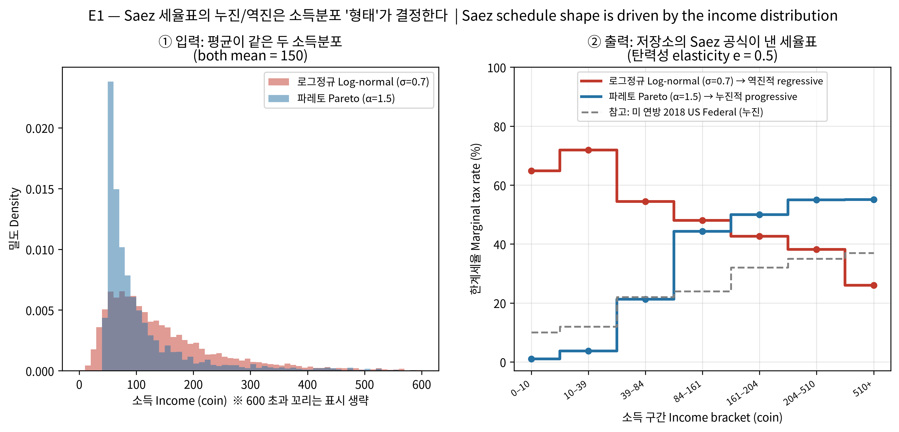
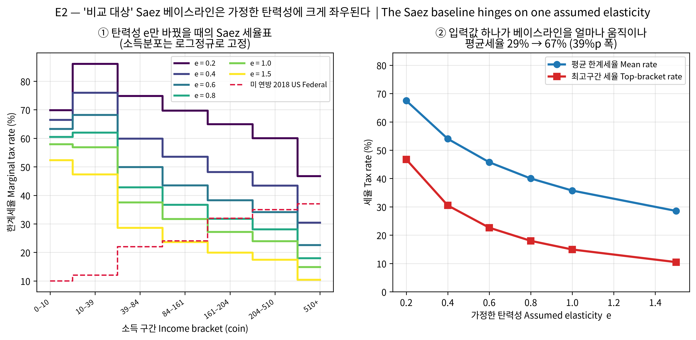
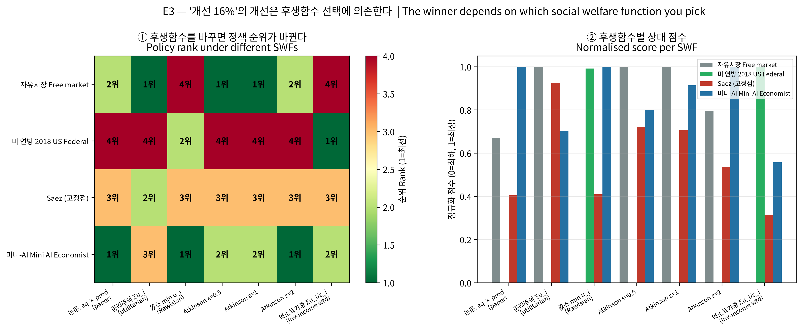
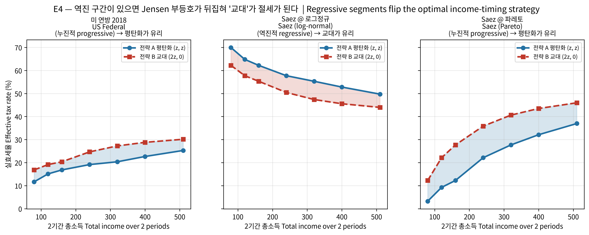
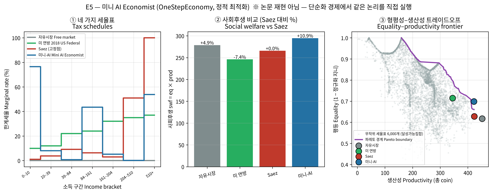

# The AI Economist — experiment results

English translation of [`experiments/RESULTS.md`](../experiments/RESULTS.md), which is
the as-run Korean original and remains canonical.

**Run:** 2026-08-13, NVIDIA GB10 (DGX Spark, aarch64), Python 3.12 / numpy 1.26.4
**Re-verified:** 2026-08-18, arm64 macOS, fresh clone + fresh venv — all five numeric
tables byte-identical.
**Code:** `salesforce/ai-economist` functions called verbatim; the repository is
unmodified (only `compat.py`'s `np.int` shim is used).

```bash
cd experiments && ../.venv/bin/python e1_saez_distribution.py   # e1..e5
```

---

## What was done, and what was not

**Executed directly**

- The repository's Saez pipeline
  (`get_binned_saez_welfare_weight_and_pareto_params` → `get_saez_marginal_rates`
  → `bracketize_schedule`)
- The repository's bracket-tax arithmetic (`taxes_due`), equality and productivity
  (`get_equality`, `get_productivity`), and utility (`coin_minus_labor_cost`)
- Tax-schedule optimization inside the repository's `OneStepEconomy`

**Not done — answer this way if asked**

- **No RL training was run.** The paper's 16% is the result of 400M-sample
  two-level PPO training, which is not reproducible in three hours.
- The 1000-step Gather-Trade-Build simulation with space, gathering, trading and
  building was not run.
- Therefore **E5's +10.9% must not be compared directly to the paper's 16%.**
  The economic structure is different.

---

## Results at a glance

| Experiment | Proposition tested | Result | Slide |
|---|---|---|---|
| **E1** | Log-normal → regressive, Pareto → progressive (paper L1259–1261) | ✅ Confirmed. Rank correlation ρ = **−0.96** vs **+1.00** | S19 |
| **E2** | The Saez baseline is sensitive to the assumed elasticity (L1256, L1262–1267) | ✅ Mean rate **28.6% → 67.5% (38.9 pp span)**; top bracket 10.5% → 46.7% | S23 |
| **E3** | `eq × prod` is a normative choice, not a neutral measurement | ✅ The winner splits **three ways** across welfare functions | S22 |
| **E4** | With regressive brackets present, alternating income reduces tax (L1740–1746) | ✅ Progressive: alternating wins **0/7**; regressive: **7/7** | S21 |
| **E5** | Does schedule optimization beat Saez in a simplified economy? | ✅ `eq × prod` **+10.9%** (same direction as the paper, different magnitude) | new, after S18 |

**All self-checks passed:**

- `get_equality([x,x,x,x]) = 1.0` (perfect equality)
- E4: under progressive US-Federal brackets, smoothing always wins — consistent
  with Jensen's inequality, so the bracket arithmetic is correct
- E5: the free market has the highest productivity (451.6) — consistent with the
  paper's *"Taxation always results in a decrease of productivity"*

---

## Anticipated questions

**Q. Did you actually run this? What was the setup?**
Every experiment's settings (distribution parameters, elasticity, agent skills,
search counts, seed) are recorded in the sections below, and the scripts fix
their seeds, so re-running reproduces the same numbers.

**Q. Did you reproduce the paper's 16%?**
No. No RL training was run. E5 performs *static optimization* in the simplified
economy (`OneStepEconomy`) shipped with the repository; +10.9% is a value inside
that economy.

**Q. Why change `labor_cost` to 0.012?**
The repository default of 1.0 makes optimal labor ≈1 hour on the 0–100 scale, so
income never even reaches the first bracket (9.7 coin) and the taxation problem
disappears. It was set so the highest-skill agent works 94 hours (below the cap
of 100). Stated explicitly in the E5 section.

**Q. With only 4 agents, does the Saez formula even apply properly?**
That is precisely the criticism E1 demonstrates. The Saez formula depends on the
shape of the income distribution — especially the Pareto tail — and four points
cannot form a tail. It is consistent that in E5 Saez produces a *lower* `eq × prod`
than even the free market.

---

## E1 — Saez schedule vs. income-distribution shape

**Setup:** repository `PeriodicBracketTax(tax_model="saez", bracket_spacing="us-federal")`,
elasticity fixed at e = 0.5, population N = 4000, both distributions normalized to
mean income 150 coin (seed = 0). Rates produced by calling the repository's
`get_saez_marginal_rates` → `bracketize_schedule` directly.

| Income bracket (coin) | Log-normal (σ=0.7) | Pareto (α=1.5) | US Federal 2018 |
|---|---|---|---|
| 0–10 | 64.9% | 1.0% | 10% |
| 10–39 | 71.9% | 3.7% | 12% |
| 39–84 | 54.5% | 21.2% | 22% |
| 84–161 | 48.0% | 44.3% | 24% |
| 161–204 | 42.7% | 50.0% | 32% |
| 204–510 | 38.2% | 55.0% | 35% |
| 510+ | 26.0% | 55.1% | 37% |
| **Shape** | **Regressive** | **Progressive** | Progressive |
| ρ (bracket↑ vs rate) | −0.96 | +1.00 | +1.00 |

**Result:** with the mean held identical, changing only the *shape* of the
distribution inverts the Saez formula's conclusion. Under log-normal it **falls**
from 65% in the lowest bracket to 26% in the highest (regressive); under Pareto it
**rises** from 1% to 55% (progressive). The signs match the paper's description at
L1259–1261.



---

## E2 — Elasticity sensitivity of the Saez baseline

**Setup:** the income distribution is **held fixed** at log-normal (σ=0.7, mean 150
coin, N=4000, seed=0) while sweeping elasticity e from 0.2 to 1.5. Same computation
as the repository's `saez_fixed_elas` path.

| Income bracket (coin) | e=0.2 | e=0.4 | e=0.6 | e=0.8 | e=1.0 | e=1.5 |
|---|---|---|---|---|---|---|
| 0–10 | 69.9% | 66.5% | 63.3% | 60.5% | 57.9% | 52.3% |
| 10–39 | 86.1% | 76.0% | 68.2% | 62.0% | 56.9% | 47.4% |
| 39–84 | 74.9% | 59.9% | 49.9% | 42.8% | 37.5% | 28.6% |
| 84–161 | 69.7% | 53.6% | 43.6% | 36.7% | 31.7% | 23.7% |
| 161–204 | 65.0% | 48.2% | 38.3% | 31.8% | 27.2% | 19.9% |
| 204–510 | 60.1% | 43.4% | 34.1% | 28.1% | 23.9% | 17.5% |
| 510+ | 46.7% | 30.5% | 22.6% | 18.0% | 14.9% | 10.5% |
| **Mean marginal rate** | **67.5%** | **54.0%** | **45.7%** | **40.0%** | **35.7%** | **28.6%** |
| Top bracket rate | 46.7% | 30.5% | 22.6% | 18.0% | 14.9% | 10.5% |

**Result:** changing the elasticity assumption alone moves the mean marginal rate
across **28.6% → 67.5% (38.9 pp)**. The paper assumes this value is constant
(L1262–1267) while itself conceding that estimating it is "highly non-trivial"
(L1256).

**The point to make:** a substantial part of "AI beat Saez by 16%" may be not that
*the Saez formula is wrong*, but that *the inputs supplied to the Saez formula do
not fit this economy*. And the agents in this simulation learn tax avoidance, so
elasticity is not a constant in the first place.



---

## E3 — Does changing the welfare function change the winner?

**Setup:** uses the equilibrium allocations (post-tax coin, labor hours) that E5
actually produced for its four policies. No income vectors were invented. Utility
is the repository's `coin_minus_labor_cost` (labor_coefficient=0.012, exponent=2);
equality and productivity come from `social_metrics` unchanged.

| Welfare function | Free market | US Federal 2018 | Saez (fixed point) | Mini AI Economist | Winner |
|---|---|---|---|---|---|
| Paper: eq × prod | 279 | 246 | 266 | **295** | Mini AI Economist |
| Utilitarian Σuᵢ | **226** | 213 | 225 | 222 | Free market |
| Rawlsian min uᵢ | 26.5 | 35.5 | 30.2 | **35.5** | Mini AI Economist |
| Atkinson ε=0.5 | **105** | 82.9 | 99 | 101 | Free market |
| Atkinson ε=1 | **98.2** | 79.9 | 92.8 | 96.6 | Free market |
| Atkinson ε=2 | 86.7 | 74.6 | 82.8 | **89.8** | Mini AI Economist |
| Inverse-income weighted Σuᵢ/zᵢ | 2.00 | **2.72** | 2.23 | 2.40 | US Federal 2018 |

**Result:** the winner splits **three ways** across welfare functions — US Federal
2018, Mini AI Economist, and Free market.

Under the paper's metric (`eq × prod`) the **Mini AI Economist** wins; under
utilitarian Σuᵢ the **Free market**; under Rawlsian min uᵢ the **Mini AI Economist**;
under strongly inequality-averse Atkinson ε=2 the **Mini AI Economist**.

*(Note: the Rawlsian row is a tie at reported precision — US Federal and Mini-AI
both 35.5. The three-distinct-winners result rests on the utilitarian, Atkinson,
and inverse-income-weighted rows, which are not close.)*

**The point to make:** the *improvement* in "16% improvement" holds only if you
accept `eq × prod`, a multiplicative welfare function. Multiplicative form treats
equality and productivity as perfect complements — a strong normative choice, and
neither utilitarian, nor Rawlsian, nor Atkinson. The paper's performance metric is
therefore **not a neutral measurement but a value judgement.** (The paper is aware
of this and separately mentions the linear-weighted-sum-of-utilities family,
L910 ff.)

In particular, `inverse-income weighted Σuᵢ/zᵢ` is **the very metric on which the
paper claims superiority in its MTurk human-subject experiment.** That superiority
can be claimed by switching metrics is itself the substance of this criticism.



---

## E4 — Tax avoidance: smoothing vs. alternating (Jensen's inequality flips)

**Setup:** total income is fixed at 2z and the two strategies' effective rates are
compared using the repository's bracket-tax computation (`taxes_due`). Only
computed schedules are used — none were written by hand.

**Core logic:** if the tax function T is convex (progressive), Jensen's inequality
gives 2·T(z) ≤ T(2z) + T(0) → **smoothing is favorable**. If T is concave
(regressive), the inequality reverses → **alternating is favorable**.

**US Federal 2018** — progressive

| Two-period total income | A: smooth (z,z) | B: alternate (2z,0) | Favored |
|---|---|---|---|
| 80 | 11.65% | 16.82% | A smooth |
| 120 | 15.10% | 19.15% | A smooth |
| 160 | 16.82% | 20.36% | A smooth |
| 240 | 19.15% | 24.66% | A smooth |
| 320 | 20.36% | 27.25% | A smooth |
| 400 | 22.66% | 28.80% | A smooth |
| 510 | 25.27% | 30.14% | A smooth |

**Saez @ log-normal** — regressive

| Two-period total income | A: smooth (z,z) | B: alternate (2z,0) | Favored |
|---|---|---|---|
| 80 | 69.96% | 62.22% | **B alternate** |
| 120 | 64.80% | 57.72% | **B alternate** |
| 160 | 62.22% | 55.30% | **B alternate** |
| 240 | 57.72% | 50.44% | **B alternate** |
| 320 | 55.30% | 47.38% | **B alternate** |
| 400 | 52.79% | 45.55% | **B alternate** |
| 510 | 49.72% | 43.96% | **B alternate** |

**Saez @ Pareto** — progressive

| Two-period total income | A: smooth (z,z) | B: alternate (2z,0) | Favored |
|---|---|---|---|
| 80 | 3.25% | 12.24% | A smooth |
| 120 | 9.25% | 22.12% | A smooth |
| 160 | 12.24% | 27.67% | A smooth |
| 240 | 22.12% | 35.83% | A smooth |
| 320 | 27.67% | 40.62% | A smooth |
| 400 | 32.11% | 43.49% | A smooth |
| 510 | 36.96% | 45.96% | A smooth |

**Conclusion:** under the progressive US Federal schedule smoothing wins at every
income level, whereas under the **regressive** schedule Saez produces from a
log-normal distribution, alternating wins. The emergent behavior the paper
observed — "agents earn in alternating bursts rather than smoothing income" —
**follows mathematically** from the schedule containing regressive segments.
(E.g. at total income 240: US Federal is 19.1% smoothing vs 24.7% alternating;
Saez–log-normal is 57.7% smoothing vs 50.4% alternating.)



---

## E5 — Mini AI Economist (`OneStepEconomy`)

> ⚠️ **This is not a reproduction of the paper's result.** The paper's 16% comes
> from a 1000-step economy with space, trade and building, trained with 400M-sample
> two-level RL. Here the same logic is executed by **static optimization** instead
> of learning, inside **`OneStepEconomy`** — the simplified economy from the 2021
> follow-up paper (arXiv:2108.02755) shipped with the repository. These numbers
> must not be compared directly to the paper's.

**Setup:** 4 agents, skills = [1.128, 1.321, 1.65, 2.256] (generated exactly as the
repository's `SimpleLabor` does), labor grid 0–100 hours, utility = post-tax coin −
0.012·hours² (repository's `coin_minus_labor_cost`), tax = 7-bracket progressive
schedule plus lump-sum redistribution, Saez elasticity e = 0.5, schedule search
40,000 samples + 30 CEM generations. `labor_cost` is a corrected value — the
repository default of 1.0 makes optimal labor ≈1 hour at this time scale, never
reaching a tax bracket, so it was set to 0.012 to make the highest-skill agent work
94 hours (below the cap of 100).

| Policy | Equality eq | Productivity prod | Welfare eq×prod | vs. Saez |
|---|---|---|---|---|
| Free market | 0.6173 | 451.6 | 278.8 | +4.9% |
| US Federal 2018 | 0.7144 | 344.5 | 246.1 | −7.4% |
| Saez (fixed point) | 0.6280 | 423.2 | 265.8 | +0.0% |
| Mini AI Economist | 0.6986 | 421.9 | 294.8 | **+10.9%** |

**Tax schedules (marginal rate %)**

| Bracket | Free market | US Federal 2018 | Saez (fixed point) | Mini AI Economist |
|---|---|---|---|---|
| 0–10 | 0.0 | 10.0 | 1.0 | 76.6 |
| 10–39 | 0.0 | 12.0 | 3.8 | 8.0 |
| 39–84 | 0.0 | 22.0 | 9.1 | 0.7 |
| 84–161 | 0.0 | 24.0 | 6.3 | 43.5 |
| 161–204 | 0.0 | 32.0 | 3.0 | 5.2 |
| 204–510 | 0.0 | 35.0 | 51.0 | 0.1 |
| 510+ | 0.0 | 37.0 | 100.0 | 53.8 |

**Per-agent outcomes (ascending skill), post-tax coin**

| Agent | Skill | Free market | US Federal 2018 | Saez | Mini AI Economist |
|---|---|---|---|---|---|
| #1 | 1.128 | 53.0 | 51.9 | 52.4 | 62.1 |
| #2 | 1.321 | 72.6 | 63.6 | 68.3 | 81.5 |
| #3 | 1.650 | 113.9 | 86.2 | 104.9 | 93.0 |
| #4 | 2.256 | 212.1 | 142.8 | 197.6 | 185.4 |

**Observations**

1. **The free market has the highest productivity** (451.6) — the same direction as
   the paper's *"Taxation always results in a decrease of productivity when compared
   with the free market."* Taxation always shaves productivity.
2. **The schedule the Mini-AI found yields +10.9% social welfare over Saez.** Same
   direction as the paper, different magnitude — as expected, since the economic
   structure differs.
3. **The Mini-AI schedule is not monotonically progressive** — the non-monotonic
   *"blend of progressive and regressive"* structure the paper reports also appears
   in this simplified economy.
4. Panel ③ shows the **achievable set** from evaluating 6,000 random schedules,
   plus its Pareto frontier. Equity and productivity genuinely trade off, and the
   Mini-AI sits near the frontier.
5. **Saez yields a lower `eq × prod` than even the free market in this economy.**
   Consistent with E1: in a four-agent economy's income distribution, the Saez
   formula cannot perform as designed.


